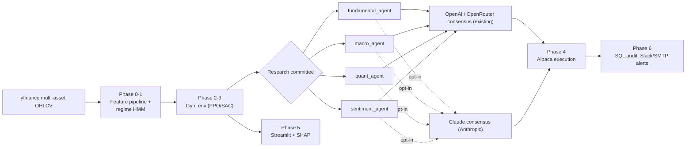

# AegisQuant

AegisQuant is a production-grade, multi-asset algorithmic trading pipeline utilizing Reinforcement Learning (PPO/SAC) combined with Large Language Model consensus scoring to actively generate systematic alpha.

The system structurally bridges the gap between pure ML research and financial deployment by embedding institutional risk-management techniques (Continuous Feature Normalization, Gaussian HMM Regime Detection, SHAP Agent Attribution, Drawdown Circuit Breakers, and Implementation Shortfall tracking).

## Core Architecture
- **Phase 0–1**: Synchronous multi-asset `yfinance` pipelines computing Z-score normalized volatility curves, fed into a Monte Carlo bootstrap walk-forward testing engine.
- **Phase 2–3**: Continuous `[-1.0, 1.0]` Gym environments optimizing portfolios natively against turnover friction and covariance/correlation penalties.
- **Phase 4**: Alpaca Broker wrappers transmuting AI weights into discrete integer lot orders execution tracking.
- **Phase 5**: Deep Streamlit UI projecting continuous SHAP permutations mapping exactly *why* the AI generated its signals.
- **Phase 6**: SQLAlchemy audit trails and active SLACK/SMTP alerting loops.

## Architecture Diagram



## Installation

```bash
# 1. Clone & Enter Directory
cd AegisQuant

# 2. Install core library requirements
pip install -r requirements.txt
# (Includes stable-baselines3, gymnasium, shap, alpaca-py, streamlit, hmmlearn, anthropic)

# 3. Secure Env Vars
cp .env.example .env
# Edit .env and supply your Alpaca or Anthropic keys.
```

## Running the Matrix

### 1. The Walk-Forward Backtester
To train the PPO model from scratch across chronological cross-fold validations mapping 10 years of OHLCV:
```bash
python src/backtest/walk_forward.py --algo PPO --mc-sims 10000
```
*Outputs will dump `model.zip` into `model_registry/` while generating exact `shap_feature_importance.json` traces.*

### 2. The Command Center (UI)
Streamlit hosts the Phase 5 interactive metrics:
```bash
streamlit run src/ui/dashboard.py
```
*Visualizes live paper-trading PnL, Regime shifts, and SHAP Global Feature Attributions.*

### 3. The Live Trading Daemon
Launch the APScheduler heartbeat. Armed with `.env` keys, it will automatically extract live states, run inference, and punch trades natively via Alpaca at exactly **09:35 AM ET** every weekday:
```bash
python main.py
```
*To force immediate execution off schedule, run `python main.py --now`.*

## LLM Consensus (Anthropic — Optional)

The default research-committee path uses `langchain-openai` via
`src/agents/base_agent.py` (also supports OpenRouter when the key starts with
`sk-or-v1`). An additive **Claude-backed consensus scorer** lives in
`src/agents/research/claude_consensus_scorer.py` and can cross-check the
fundamental / macro / quant / sentiment slate before the executive agent
commits to a direction:

```python
from src.agents.research.claude_consensus_scorer import score_consensus

verdict = score_consensus(
    ticker="AAPL",
    proposals=[fundamental_out, macro_out, quant_out, sentiment_out],
)
# -> {"consensus": "BUY", "confidence": 0.72, "rationale": "...", "model": "claude-sonnet-4-6"}
```

Behaviour:

- Returns a structured `ABSTAIN` dict when `ANTHROPIC_API_KEY` is unset, when
  the `anthropic` package is not installed, or on any LLM / parse failure.
- Never raises — safe to call unconditionally from the executive agent.
- Defaults to `claude-sonnet-4-6`; override per call with the `model=` kwarg
  or globally via the `ANTHROPIC_MODEL` env variable.

The existing OpenAI / OpenRouter flow is untouched, so this is a pure
additive upgrade rather than a replacement.

## System Testing
The codebase is mapped heavily against `pytest`. Execute safety verifications before pushing model states up to Staging/Production:
```bash
python -m pytest tests/
```

## Authors
_Built originally to merge Modern Portfolio Theory with Autonomous AI frameworks._
