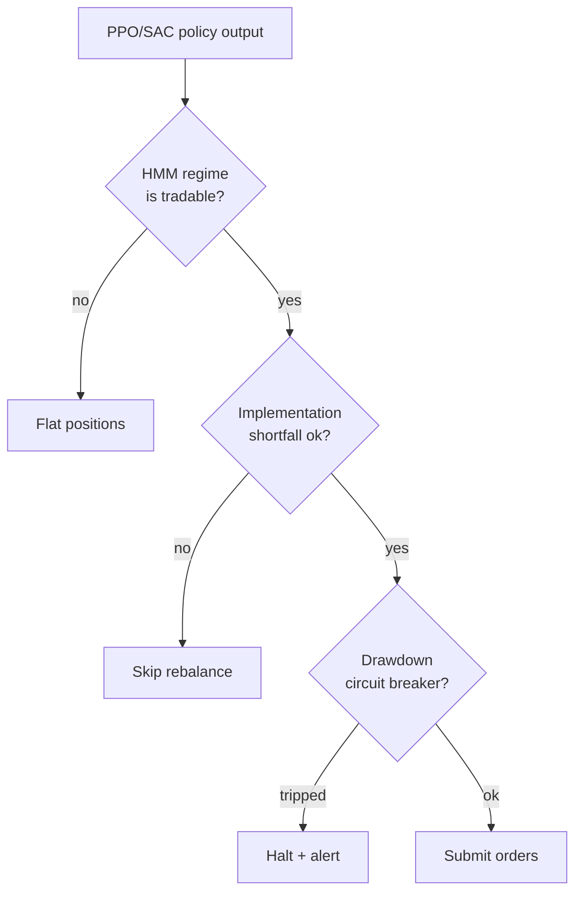

# AegisQuant Architecture

High-level view of how data, models, and execution flow through the system.
For the prose narrative see the top-level `README.md`. For specific phase
detail see `plan.md` and `PROFESSIONAL_TRADER_UPGRADE.md`.

## End-to-end flow

```mermaid
flowchart LR
    subgraph Phase0_1["Phase 0–1 — Data"]
        A1["yfinance / Groww feed"] --> A2["Z-score normalized features\nVolatility curves"]
        A2 --> A3["Monte Carlo walk-forward bootstrap"]
    end

    subgraph Phase2_3["Phase 2–3 — RL"]
        B1["Continuous [-1, 1] Gym env\nTurnover + covariance penalties"] --> B2["PPO / SAC training\nstable-baselines3"]
        B2 --> B3["model_registry/*.zip"]
    end

    subgraph Phase4["Phase 4 — Execution"]
        C1["AI portfolio weights"] --> C2["Alpaca / Groww adapter\nWeights → integer lots"]
        C2 --> C3["Live order submission\n09:35 ET weekday"]
    end

    subgraph Phase5["Phase 5 — UI"]
        D1["Streamlit dashboard"] --> D2["SHAP attribution\nRegime (HMM) overlay"]
        D2 --> D3["Live PnL + drawdown"]
    end

    subgraph Phase6["Phase 6 — Ops"]
        E1["SQLAlchemy audit trail"] --> E2["Slack / SMTP alerts"]
        E2 --> E3["Drawdown circuit breaker"]
    end

    A3 --> B1
    B3 --> C1
    C3 --> E1
    B3 --> D1
    C3 --> D3
```

## Risk gates

## Components by directory

| Path | Responsibility |
| --- | --- |
| `src/backtest/` | Walk-forward backtester, MC bootstrap, audit reporting |
| `src/ui/dashboard.py` | Streamlit command center, SHAP + regime visuals |
| `main.py` / `main_us.py` / `main_india.py` | APScheduler live-trading entry points |
| `model_registry/` | Versioned RL policy artifacts |
| `tests/` | Pytest safety verifications |
| `deploy/` | Container + scheduler deployment assets |

The Mermaid diagrams above render natively on GitHub. To export to PNG locally
you can pipe them through `mmdc` (`@mermaid-js/mermaid-cli`).
